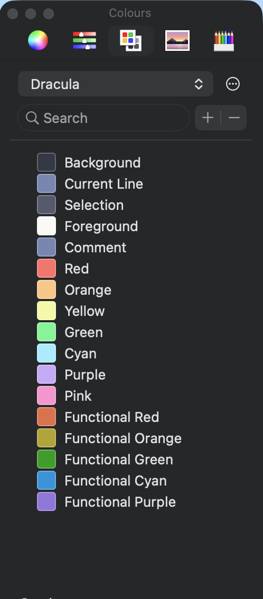
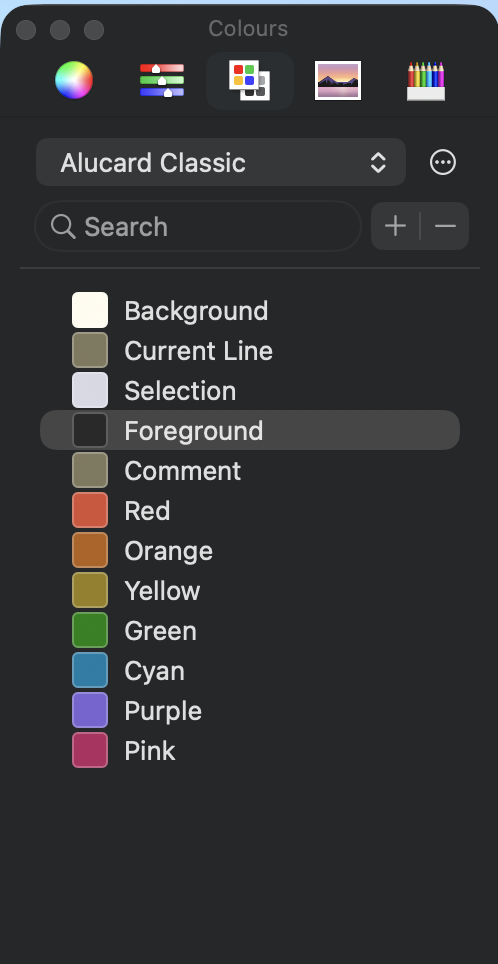

# Dracula for MacOS Color Picker

> Manually created colour palettes for MacOS users supporting Dracula and Alucard.

 

## Features
- Works without Homebrew, Node.js, or the broken upstream repo.
- Easy installation: drop into `~/Library/Colors`

## Install

All instructions can be found at [draculatheme.com/macos-dracula-colour-picker](https://draculatheme.com/macos-dracula-colour-picker).

## Team

This theme is maintained by the following person(s) and a bunch of [awesome contributors](https://github.com/dracula/macos-dracula-colour-picker/graphs/contributors).

## Community

- [Twitter](https://twitter.com/draculatheme) - Best for getting updates about themes and new stuff.
- [GitHub](https://github.com/dracula/dracula-theme/discussions) - Best for asking questions and discussing issues.
- [Discord](https://draculatheme.com/discord-invite) - Best for hanging out with the community.

## Dracula PRO

## License

[MIT License](./LICENSE)
